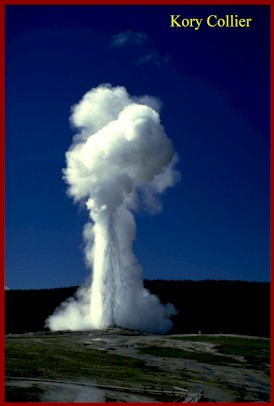

# Feature Type: Geyser 
# Geyser/Spring Type: Cone geyser
### Old Faithful is a cone-type geyser. Since 2000 its intervals have varied from 44 to 125 minutes, with an average of about 90-92 minutes, its duration is 1 1/2 to 5 minutes and its height is 90 to 184 feet.

--- #guide bg:url(https://github.com/chidemannie/GeyserApp/blob/master/App%20Guide.png)

# Geyser App Guide

--- 

It is not possible to predict more than one eruption in advance. Old Faithful is currently bimodal. It has two eruption durations, either a long (over 4 minutes) or more rarely a short (about 2-1/2 minutes). Short eruptions lead to an interval of just over an hour and long eruptions lead to an interval of about 1-1/2 hours. 

In the past the interval was predicted using more precise measurements of the duration of the current eruption. The duration was timed from the first heavy surge which lifts water skyward at the start of the eruption until the last small splash above the cone at the very end. 

The longer the eruption lasted, the longer the interval until the next eruption. The following regression table was used. 

---

Duration Interval 

 1.5min 51 min 

 2.0min 58 min 

 2.5min 65 min 

 3.0min 71 min 

 3.5min 76 min 

 4.0min 82 min 

 4.5min 89 min 

 5.0min 95 min 

The above table is shown for historic purposes. Predictions are currently based only on short or long durations. This simpler prediction model still results in a 90 percent accuracy of the predictions. 

https://chidemannie.shinyapps.io/GeyserApp/

